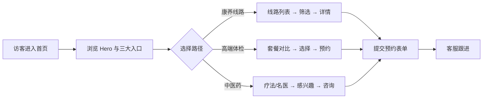

# 重庆医疗旅游 — 产品需求文档 (PRD)

## 1. 产品概述

「渝见康养」是一个面向国内外游客的重庆医疗旅游门户网站，聚焦"山城康养"主题，整合重庆高端体检、温泉疗养、传统中医药与精品旅游线路资源，让用户在一次旅行中完成"看、养、游、疗"的完整体验。
- 目标用户：注重健康的中高端游客、企业团检客户、银发康养群体、对中医药感兴趣的境外游客
- 核心价值：把重庆的山、雾、汤、药、城融合为可一站式预定的医疗旅游产品

## 2. 核心功能

### 2.1 用户角色
本项目以内容展示 + 咨询预约为主，不做完整账户体系。访问者通过浏览获得信息并通过表单提交预约意向。
| 角色 | 进入方式 | 核心权限 |
|------|----------|----------|
| 访客 | 直接访问 | 浏览全部页面、提交预约咨询 |
| 客服（隐式） | 接收表单数据 | 在后台跟进预约（本期不实现后台） |

### 2.2 功能模块
1. **首页**：山雾意境 Hero、三大入口（康养线路 / 高端体检 / 中医药）、数据亮点、特色疗愈场景、推荐行程、用户证言、底部咨询表单
2. **康养线路页**：6 条山城主题线路（温泉疗愈 / 江峡养心 / 中医世家 / 古道徒步 / 古镇静修 / 都市医美）、可按天数 / 主题筛选、线路详情对比
3. **体检套餐页**：4 档体检产品（基础 / 深度 / VIP / 尊享）、可视化指标展示、机构介绍、套餐对比表
4. **中医药页**：传统疗法（针灸 / 推拿 / 艾灸 / 药浴 / 中药膏方）、名医馆、二十四节气养生、药材溯源故事
5. **关于 / 联系页**：品牌故事、合作伙伴、联系咨询表单、地图占位

### 2.3 页面细节
| 页面 | 模块 | 功能说明 |
|------|------|----------|
| 首页 | Hero | 全屏山雾动态视觉 + 标题 + 双 CTA（查看线路 / 预约咨询） |
| 首页 | 数据亮点 | 4 个核心数据（合作机构 / 累计服务 / 线路数量 / 客户满意度）滚动进入动画 |
| 首页 | 三大入口 | 三张风格化卡片，分别链接到线路 / 体检 / 中医 |
| 首页 | 推荐行程 | 横向滚动卡片，移动端可滑动 |
| 首页 | 咨询表单 | 姓名 / 电话 / 需求类型 / 留言 + 提交 |
| 线路页 | 筛选器 | 天数、主题切换；点击筛选即时过滤 |
| 线路页 | 线路卡片 | 含封面、主题标签、时长、价格、亮点 |
| 线路页 | 对比表 | 选中 2-3 条线路横向对比 |
| 体检页 | 套餐网格 | 4 张定价卡，含项目数量、推荐人群、CTA |
| 体检页 | 流程时间线 | 6 步流程（预约 → 到院 → 体检 → 解读 → 跟踪 → 复检） |
| 体检页 | 机构介绍 | 滑动 logo 墙 + 文字简介 |
| 中医页 | 疗法 Tab | 5 个疗法切换，每种含图文说明 |
| 中医页 | 名医卡 | 3-4 位医师，含专长与坐诊时间 |
| 中医页 | 节气养生 | 12 节气卡片，选中展开养生建议 |
| 关于页 | 品牌故事 | 双栏图文 + 关键里程碑 |
| 关于页 | 联系表单 | 与首页咨询表单复用结构 |

## 3. 核心流程

## 4. 用户界面设计

### 4.1 设计风格
- **美学方向**：东方禅意 × 山城意境（Eastern Zen × Mountain Mist）
  - 以"墨、山、雾、汤"为视觉母题，营造雅致而有温度的康养氛围
- **主色**：墨青 `#1f2a2e`（主色，背景与标题）
- **辅色**：烟白 `#f4efe6`（底色）、朱砂 `#b5371f`（强调 CTA）、竹青 `#5b8a72`（健康 / 医疗）、金 `#c5a253`（高端点缀）
- **字体**：标题用 "Noto Serif SC"（思源宋体 SC）做衬线东方感；正文用 "Noto Sans SC"；数字英文用 "Cormorant Garamond" 提升雅致度
- **按钮风格**：圆角 2px（接近直角，少量倒角），墨青底白字或朱砂描边；hover 时位移 2px + 阴影
- **布局风格**：编辑杂志风（Editorial），顶部大留白 Hero + 章节式分屏 + 不对称网格 + 大量留白
- **动效**：进入视口淡入上移（IntersectionObserver）、图片缓慢 ken-burns、表单提交后状态切换
- **图标**：lucide-react
- **图像**：使用 text_to_image 占位（山城雾景 / 温泉 / 中药材 / 古镇）

### 4.2 页面设计概览
| 页面 | 模块 | UI 元素 |
|------|------|---------|
| 首页 | Hero | 全屏山雾图、衬线大标题（"渝见·康养"）、双 CTA、底部细线导航 |
| 首页 | 数据亮点 | 4 个数字（衬线大字 + 副标题），滚动进入上移淡入 |
| 首页 | 三大入口 | 三张卡（错落排布），hover 抬起 + 内部小图缩放 |
| 首页 | 推荐行程 | 横向滚动条 + 进度条 |
| 首页 | 证言 | 大引号衬线引用 + 客户头像 + 城市 |
| 线路页 | 筛选器 | 顶部细线，胶囊按钮 |
| 线路页 | 卡片 | 左图右文，垂直堆叠时图片置顶 |
| 体检页 | 套餐网格 | 4 列卡片，中间一列高亮（推荐） |
| 体检页 | 流程时间线 | 左侧细线 + 圆点 + 数字 |
| 中医页 | 疗法 Tab | 顶部横向 tab + 内容区图文 |
| 中医页 | 节气养生 | 12 卡片六角形排布，hover 浮起 |
| 关于页 | 故事 | 左侧衬线大字 + 右侧正文 + 数字小标 |

### 4.3 响应式
- Desktop-first：1440 / 1280 设计稿
- 平板：≥768px 调整列数与字号
- 移动端：<768px 全部转为单列、汉堡菜单、卡片纵向堆叠

### 4.4 3D 场景
本期不涉及 3D 场景；视觉以高质量图片 + 微动效（CSS / IntersectionObserver）实现。
