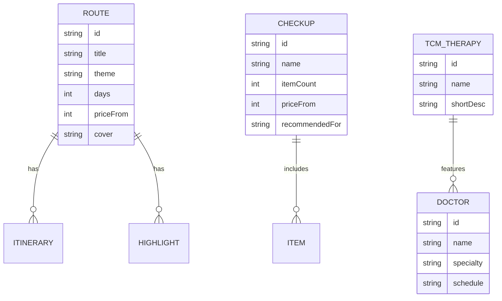

# 重庆医疗旅游 — 技术架构文档

## 1. 架构设计

本期为内容展示 + 表单咨询网站，无后端持久化；为未来接入后台预留扩展点。

```mermaid
flowchart TB
  subgraph Frontend["前端 (React + Vite + TypeScript)"]
    UI[页面组件]
    Router[React Router]
    Store[Zustand: 表单状态 / 筛选状态]
    Data[静态数据 (src/data)]
  end
  subgraph Future["未来扩展（本期未实现）"]
    API[Express 后端]
    DB[(SQLite / Postgres)]
  end
  UI --> Router
  UI --> Store
  UI --> Data
  UI -.预约表单提交.- API -.-> DB
```

## 2. 技术选型

- **框架**：React 18 + TypeScript
- **构建**：Vite 5
- **样式**：TailwindCSS 3 + 自定义 CSS 变量（色彩 / 字体 / 间距）
- **路由**：react-router-dom v6
- **状态管理**：zustand（仅用于全局表单草稿与筛选状态）
- **图标**：lucide-react
- **字体**：Noto Serif SC / Noto Sans SC / Cormorant Garamond（通过 Google Fonts CDN 引入）
- **图片**：text_to_image 生成的占位图（落地图为本地 URL）
- **后端**：本期不实现；表单提交用 `console.log` + 客户端成功提示，预留 `submitInquiry()` 抽象函数

## 3. 路由定义

| 路由 | 用途 |
|------|------|
| `/` | 首页（Hero + 入口 + 数据 + 推荐行程 + 证言 + 咨询） |
| `/routes` | 康养线路列表（筛选 / 卡片 / 对比） |
| `/routes/:id` | 线路详情（亮点 / 行程 / 包含项目 / 咨询 CTA） |
| `/checkup` | 体检套餐页（套餐 / 流程 / 机构） |
| `/tcm` | 中医药专题（疗法 / 名医 / 节气） |
| `/about` | 关于我们（品牌故事 / 合作 / 联系） |

## 4. API 定义（未来）

```ts
// POST /api/inquiry
type Inquiry = {
  name: string
  phone: string
  email?: string
  topic: 'route' | 'checkup' | 'tcm' | 'other'
  message: string
}
type InquiryResponse = { ok: true; id: string } | { ok: false; error: string }
```

## 5. 服务器架构（本期不实现）
预留扩展：
```
Controller (POST /inquiry) → Service (InquiryService) → Repository (InquiryRepo) → SQLite
```

## 6. 数据模型

### 6.1 数据模型定义



### 6.2 数据来源
- 所有数据为静态 JSON（`src/data/*.ts`），便于编辑与维护
- 暂不引入数据库

## 7. 项目结构

```
src/
├─ main.tsx
├─ App.tsx
├─ index.css            # 全局样式 / Tailwind 入口 / 字体
├─ components/          # 复用组件
│  ├─ Navbar.tsx
│  ├─ Footer.tsx
│  ├─ InquiryForm.tsx
│  ├─ SectionTitle.tsx
│  ├─ Reveal.tsx        # 滚动进入动画
│  └─ ...
├─ pages/
│  ├─ Home.tsx
│  ├─ Routes.tsx
│  ├─ RouteDetail.tsx
│  ├─ Checkup.tsx
│  ├─ TCM.tsx
│  └─ About.tsx
├─ data/
│  ├─ routes.ts
│  ├─ checkups.ts
│  ├─ tcm.ts
│  └─ testimonials.ts
├─ store/
│  └─ useInquiryStore.ts
└─ utils/
   └─ format.ts
```
